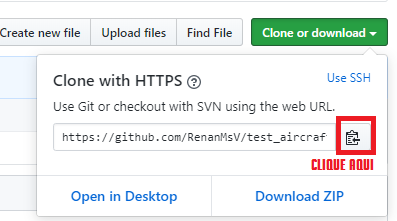

Como usar o Git/Github para fazer aeronaves mais eficientemente?

Git pode ser usado para o gerenciamento de versões de sua aeronave.
É muito util e deve ser utilizado para economia de tempo e trabalho manual.

Existe uma diferença entre GIT e GITHUB. Git é o software que gerencia seu projeto. GIT é acessado totalmente por linhas de comando no Command Prompt (CMD). o GITHUB é um site em que voce hospeda esse projeto. Tambem é possivel no GITHUB visualizar todas versões e detalhes do projeto mais facilmente.

Para utilizar o Git é preciso instala-lo:
Instale o Git - [https://git-scm.com/download/win](https://git-scm.com/download/win)

Para utilizar o Github é preciso criar uma conta nele:
Crie sua conta - [https://github.com](https://github.com/join?source=header-home)

### Ajudando / Corrigindo a aeronave de alguem:

Neste tutorial vamos trabalhar utilizando este repositorio de teste: [https://github.com/RenanMsV/test_aircraft](https://github.com/RenanMsV/test_aircraft)

Digamos que voce queira ajudar alguem e arrumar um erro da aeronave dele. Desde que a aeronave dele esteja no Github (ou site similar como GitLab, etc..) basta:

##### Fazer uma copia (fork) do repositorio

Fazer uma fork significa copiar o projeto de alguem (no caso uma aeronave) para sua conta do Github. Ou seja, dai você poderá fazer alterações e correções.
Para criar uma fork vá até o repositorio no navegador e clique no botão FORK.
Após algum tempo ele abrira a pagina do projeto em sua conta. Pronto voce acabou de 'forkar' a aeronave de alguem!.

##### Clonar o repositorio

Agora que voce fez uma copia em sua conta voce tem que editar. Mas como editar?
Para editar voce precisa clonar. Clonar significa copiar o que está em um repositorio do Github para uma pasta em seu computador. Assim voce poderá fazer alterações.

Voce pode clonar repositorios de qualquer pessoas, mas somente pode fazer upload de alterações em repositorios em que voce tem permissao, como os seus repositorios e o de amigos que lhe derem essa permissao.
Para clonar abra no navegador e pegue a url de clonagem (clicando no botão verde clone or download).

No meu caso a url é essa https://github.com/RenanMsV/test_aircraft.git.
Agora abra o CMD do windows (para abrir faça a combinação de tecla Windows + R, digite cmd e aperte Enter).

Dentro do CMD digite:

    cd %userprofile%/desktop

E aperte Enter. O CMD será direcionado a pasta da area de trabalho.

Agora dentro do CMD digite:

    git clone https://github.com/RenanMsV/test_aircraft.git

Após isso será baixado e os arquivos da aeronave estará na pasta Desktop/test_aircraft

Quando terminar digite:

    cd %userprofile%/desktop/test_aircraft

E o CMD será direcionado para a pasta da aeronave.

##### Criar uma nova branch

Quando for alterar algo da aeronave basta criar uma nova branch. Branch significa ramo, ou versão. Cada alteração minima em um arquivo cria uma nova versão.

Precisamos criar uma versão nova com base em uma versão atual da aeronave.
No geral a branch atual é a master, mas alguns desenvolvedores podem ter outra como atual.

Branchs devem conter um nome, escolha algo simples que signifique o que voce está querendo mudar.

Não utilize letras com acentos ou espaços.

No nosso exemplo iremos criar uma nova branch com o nome 'correcoes-aeronave':

Dentro do CMD digite:

    git checkout -b correcoes-aeronave

O CMD irá mostrar "switched to a new branch 'correcoes-aeronave'", que significa que voce conseguiu criar uma nova branch com sucesso! e ela contem todos arquivos da branch master.

Agora basta que voce faça as mudanças.
Voce pode editar arquivos, apagar, adicionar, qualquer coisa.
Somente nunca tente apagar/modificar a pasta chamada '.git'. Ela contém todas as configurações do projeto e sem ela nada funciona.

#### Fazendo commit das suas alterações

Depois que alteramos coisas podemos fazer commit delas.

Commit é como se voce documentasse suas mudanças, criando assim uma nova versão nao catalogada como Branch mas sim como commit. Digamos que voce tenha alterado um arquivo e feito o commit. Depois de semanas percebeu que voce alterou o arquivo errado... como proceder? Voce reverte a commit que voce fez errada e o arquivo vai voltar a ser o que era antes.

Commitar varias vezes aos poucos enquando faz alterações é interessante, mas não é necessario. Apenas uma commit é obrigatória para fazer upload das mudanças.

Para fazer a commit é necessario uma mensagem que é mais como uma descrição do que voce alterou. No nosso exemplo vou dizer que coloquei um novo arquivo.

Primeiro vamos verificar se está tudo certo dando o comando

    git status

Está tudo certo, mostrando ali de vermelho um arquivo 'untracked' ou seja um arquivo novo. Mas ele ainda precisa ser adicionado ao projeto, apesar de estar dentro da pasta do projeto ele ainda não faz parte do projeto.

Para adicionar esse arquivo no projeto digitamos:

    git add novo-arquivo.txt

Ou podemos digitar isso para adicionar todos os arquivos novos de uma vez:

    git add .

Agora para fazer a commit digite:

    git commit -m "Adicionando novo-arquivo.txt"

Repare que é necessario a mensagem estar entre aspas.

#### Fazendo upload das suas alterações (push)

Depois de alterar tudo que voce tinha pra alterar é necessario enviar as alterações para o Github.
Para fazer isso é necessário ter feito pelo menos 1 commit. Se não fez faça a sua commit agora.

Então para fazer o push é necessario saber o nome da branch que no meu caso é 'correcoes-aeronave' e digitar:

    git push origin correcoes-aeronave

#### Requisitando mudanças (pull request)

Pronto voce ja fez correções e fez upload dessas correções na sua conta. Mas agora é preciso alterar o repositorio oficial, de quem voce clonou. Para isto é preciso criar uma pull request no Github.

Para criar uma pull request vá no seu repositorio neste caso [https://github.com/RenanMsV/test_aircraft](https://github.com/RenanMsV/test_aircraft), no botão chamado branch escolha a branch correcao-aeronave

Clique em pull request.

A branch a esquerda signica a branch que recebera as alterações, e a direita é a branch que contém as alterações. No meu caso está correto, master <- correcao-aeronave

Clique em Create pull request.

Pronto, agora sua pull request foi criada e o dono do repositorio pode então aceitar ou recusar suas alterações.
Caso o dono de pedir para alterar algo em sua correção basta fazer essas alterações, commitar, e fazer o push novamente. Não é necessario abrir nova pull request.

Aqui um exemplo de quando aceitam sua sugestão e fazem o merge (junção) de suas alterações com a aeronave oficial.

***

#### Pratica

Como o Git é um programa totalmente por linhas de comando é necessario pratica para usa-lo com perfeição. Não desista e lembre-se, o Google é seu amigo.
